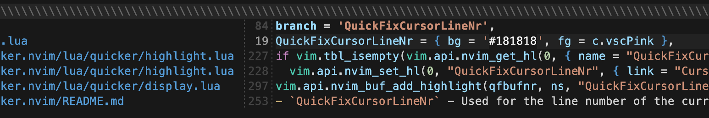
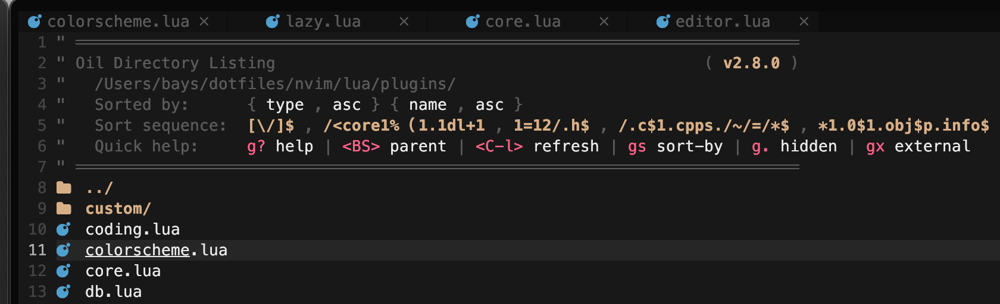
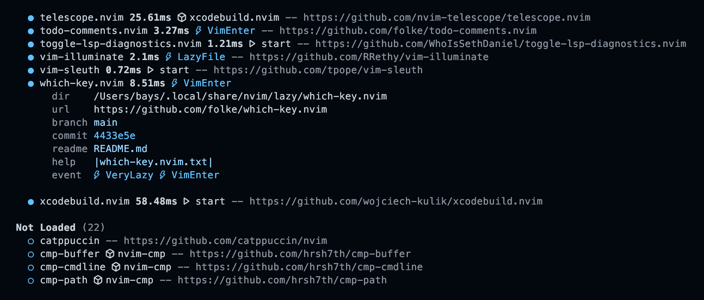

# neostuff

Collection of plugins and forks used in [Neovim](https://github.com/neovim/neovim).

<!-- TOC -->

- [Plugins](#plugins) (my own)
    - [head.nvim](#headnvim)
    - [ncks.nvim](#ncksnvim)
- [Forks](#forks) (others)
    - [quicker.nvim](#quickernvim)
    - [oil.nvim](#oilnvim)
    - [lazy.nvim](#lazynvim)

<!-- /TOC -->

## Plugins

My own plugins written in Lua for my own use. Very barebones and potentially none functional. I'm still learning Lua and Neovim plugin development, so these are more for my own learning and experimentation right now.

### [head.nvim](https://github.com/956MB/head.nvim)

Plugin for adding and automatically updating file headers. WIP.

[#neovim](https://github.com/topics/neovim) [#neovim-plugin](https://github.com/topics/neovim-plugin) [#plugin](https://github.com/topics/plugin) [#lua](https://github.com/topics/lua) [#file-header](https://github.com/topics/file-header)

### [ncks.nvim](https://github.com/956MB/ncks.nvim)

Tiny utility plugin to append Discord nickname ideas to a file without leaving Neovim.

[#neovim](https://github.com/topics/neovim) [#neovim-plugin](https://github.com/topics/neovim-plugin) [#plugin](https://github.com/topics/plugin) [#lua](https://github.com/topics/lua) [#discord](https://github.com/topics/discord) [#nickname](https://github.com/topics/nicknames) [#telescope](https://github.com/topics/telescope)

## Forks

Forks of other plugins that I use heavily and have made changes to. Usually very minor quality-of-life improvements though.

<h3 id="quickernvim">quicker.nvim Link TBA</h3>

_Author: [stevearc](https://github.com/stevearc) ([quicker.nvim](https://github.com/stevearc/quicker.nvim))_

- Adds cursor line number highlight (CursorLineNr) to the **quicker.nvim** quickfix list. Follows the cursor movement and updates like normal line numbers.

<h3 id="oilnvim">oil.nvim Link TBA</h3>

_Author: [stevearc](https://github.com/stevearc) ([oil.nvim](https://github.com/stevearc/oil.nvim))_

- Adds the `netrw` directory listing UI to the **oil.nvim** file explorer. I like the way it looks, it fills out the top of the oil buffer a bit more. The _"Sort sequence"_ line is currently nonsense... I haven't figured out how to make use of this yet, but it's still nice having it there anyway :)

### [lazy.nvim](https://github.com/956MB/lazy.nvim)

_Author: [folke](https://github.com/folke) ([lazy.nvim](https://github.com/folke/lazy.nvim))_

- Adds a URL to the end of each plugin entry line in the **lazy.nvim** Home/Summary page, making displaying the entire page or finding a plugin's URL easier. (Can be toggled with the `T` key.)

## License

[MIT License](./LICENSE)
